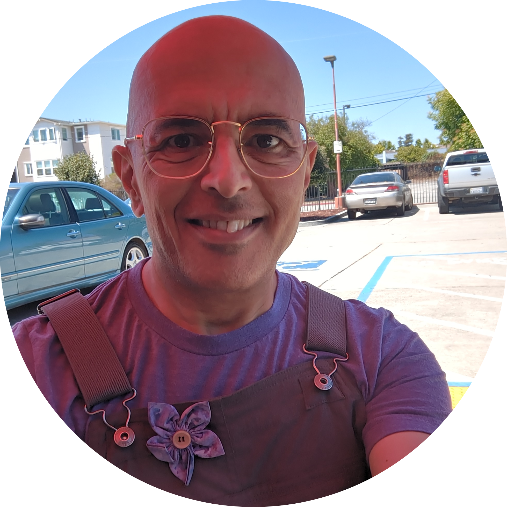

    

        
    

    

        
My name is Ihab Awad. Welcome to my online portfolio!

        
I am an engineer, visionary, and maker. I build things for a living and for fun, and lead teams with enthusiasm and a growth mentality for myself and for others. I learn what I need to – usually but not always in engineering – to accomplish my goals. I seek interesting problems, and a place where my leadership style is appreciated and can thrive.

        
I hope the material here can give you an idea of what I'm about and what excites me.

    


  

    
{{ section.title }}

    

      
        
      
    

  



Content credits:
<ul>
<li><a href="https://pixabay.com/users/hai443-39753619/">Hai443</a></li>
<li><a href="https://www.flaticon.com/free-icons/pinky-promise" title="pinky promise icons">Pinky promise icons created by Freepik - Flaticon</a></li>
</ul>

