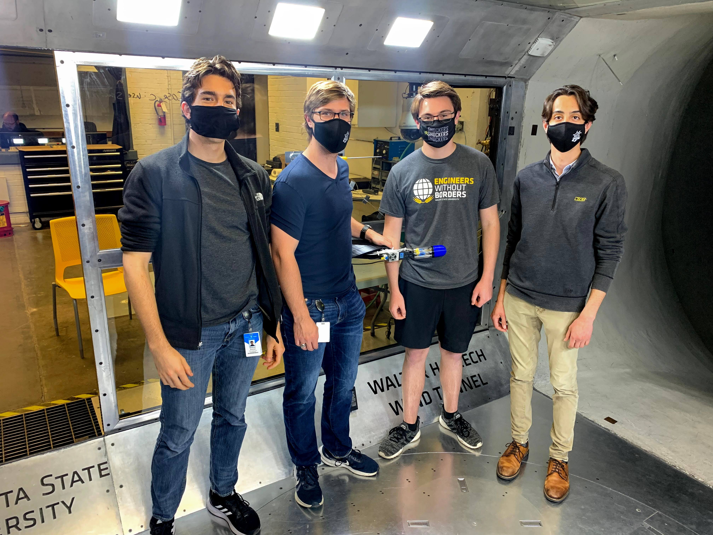

My long-standing personal project, creating a novel aircraft instrument, has been very rewarding and eductional for me.

## Inflight loss of control

Loss of control inflight is an important problem leading to injuries and fatalities in aviation. Very broadly, this occurs when the airplane is flown in such a way that its wings can no longer be effective at controlling where it goes (including, keeping it up in the air). The effectiveness of the wings is in turn dependent on the _relative wind_ -- the strength and direction of the air flow as viewed from the position of the airplane.

Consider an airplane cruising along. It is likely moving straight ahead through the air, and the air flow impinging on it is, conversely, coming from straight ahead:

Now consider an airplane preparing to land. It is likely moving slowly, and flying downwards. However, the way it is moving _through the air_ is such that it is _mushing_ downwards, and the air flow impinging on it is weaker and comes much more from below.

The basic idea here is: _airplanes are not necessarily moving where they are pointed_. This is intentional. But under certain conditions, particularly when slow or when making sharp turns, the direction of the airflow can result in an [aerodynamic stall](https://en.wikipedia.org/wiki/Stall_%28fluid_dynamics%29) where the wings lose lift -- i.e., lose the ability to control the airplane. This condition can cause the airplane to drop suddenly, and sometimes even to spin out of control. And if this happens near the ground, a pilot may not have time to react properly. Click on the below image for a video of that happening at a safe height:

## Relative wind visualization

In a typical airplane, a pilot sees something like this:

Because air is invisible, the all-important relative wind is not clear; it has to be interpreted from numerous instruments and readouts. But the relative wind is a _vector_. What if we visualized it as such? The orientation relative to the nose of the airplane can be visualized by the location of a dot, as though the pilot could see the vector out the window:

And the strength of the relative wind can be represented by the size of the dot, as though the vector were growing and shrinking in the windshield:

This is the basis of my project: to _measure_ the relative wind with fidelity, and _visualize_ it intuitively.

## X-Plane and Google Glass

The first iteration of this idea was an Android app, using flight data broadcast via UDP from the [X-Plane](https://www.x-plane.com/) flight simulator. Here is the app, and my son "flying" it:

|  |  | 

What followed was a "science fair" style demo rig, for my pilot friends to try out.

Another demo was to run the Android app in Google Glass, using Bluetooth and another Android device to broadcast actual flight data from my friend Paul Eastham's airplane:

## EAA Founder's Innovation Prize

I entered my idea as a proposal to a competition held by the Experimental Aircraft Association, and [won first prize](https://www.eaa.org/airventure/eaa-airventure-news-and-multimedia/eaa-airventure-news/eaa-airventure-oshkosh/07-27-2016-airball-wins). This provided a boost of confidence -- and some funding -- to proceed.

All in all, I wrote 3 reports to the EAA, which you can read here:

* [2016 EAA Founder’s Innovation Prize Entry](https://drive.google.com/file/d/0B1WyIFBvIVXGaEo5M1BkSVBIYnM/view?usp=drive_link&resourcekey=0-hKeU2Cs2CQLbSydsGagICg)
* [2018 EAA Founder’s Innovation Prize Entry](https://drive.google.com/file/d/19jX5vYdsG4OXD59Apxj7Yl_7_6Oo2iwy/view?usp=sharing)
* [2021 EAA Founder’s Innovation Prize Entry](https://drive.google.com/file/d/1CLmlZuDzg3iunJi1LHqINDj63gcTR4US/view?usp=sharing)

## First prototypes

After the 2016 EAA event, I set out to build the device I had proposed: A low cost air data measurement and display device. The first display unit was made from a basic Raspberry Pi and an LCD panel, with a laser cut plastic bezel:

|  |  | 

The first air data measurement probe started out as a bunch of breakout boards and bare wiring:

|  |  |  | 

The next step was to try to test this versus some known airspeeds. I tried creating a "mast" on top of the family car, with a whole rigging and retraction system, so I could mount the probe on top, drive down the road, and get data:

|  |  |

Unfortunately, the lesson I learned is that the air flow near the ground around roads is _incredibly_ turbulent. I certainly got some readings, but they were unusably noisy. However, for a while, I was the most ridiculed geek in my neighborhood, and _nobody_ was going to steal that car....

## Testing at Wichita State University

Through a chance posting on Facebook, I got in contact with a team of aeronautical engineering students at Wichita State University, led by 

|  |  |