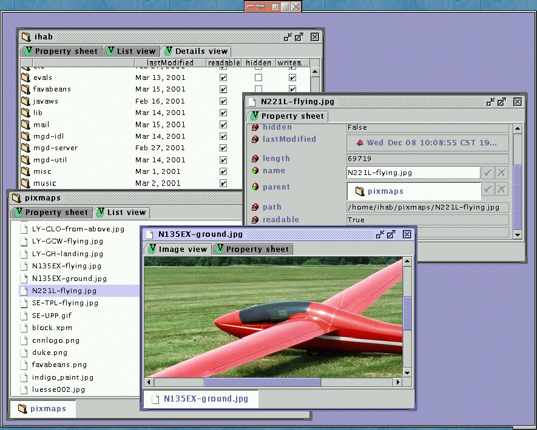

FavaBeans was a framework for building metadata driven object-oriented user interfaces to data and computation, primarily targeting scientific computing.

## Object-oriented user interfaces

In an OOUI, users perceive, and act upon, visual interactors representing nouns in their domain of interest. The concept of an _application_ does not usually show up. Users typically initiate tasks by creating a new object representing the work. For example:

To start the task of mapping some data of interest, a user drags from a "stationery pad" of `Map` objects, creating the object **New map**. The user then browses through a list of businesses, which is represented as a kind of "smart folder" -- to the user, it behaves just like any other folder in the system. The user locates the object **Bob's bagels** and, to represent that in their map, they drag that object over to **New map**. The nouns, in the user's mind, are the stationery pad that constructs `Map` objects; **New map**; **Businesses**; and **Bob's bagels**. Some verbs are implied by the drag-drop interactions. Other verbs might include specific affordances, for example, panning and zooming in **New map**.

## Objects versus tables

One of the interesting aspects of scientific computing is the interplay between _objects_ and _tables_:

* We use an _object_ perspective is when we interact with a simulationist model of the world, for example, a node in a phylogenetic tree, or a model of a protein that has behaviors and can model interactions with other proteins.

* We use a _table_ perspective when we tabulate related pieces of information, adding more information as we find it from other sources.

This tension shows up when we store data in SQL databases and re-constitute it using object-relational mappings like SQLAlchemy for operational use, but also cut and slice the SQL data to create dashboards and reports.

The FavaBeans project very specifically used metadata to allow us to build a user interface that could collect related properties together to form objects, and slice up collections of object to form tables.

## FavaBeans demos

Since this project is very old, I only have screenshots of some of the more generic demos lying around. Below is a super simple version of the system showing a portion of the file system. Each window displays a distinct object, and each tab is a kind of view of that object. Here you can see the idea of a "folder" (which is a general concept, but in this case is mapped to a directory) showing a view of its contents with columns derived from the properties of the type of the contents. You can also see "property sheet" views of objects, where relationships to other objects are shown as editable cells.

## Related work

A contemporary, and similar, framework is [Naked Objects](https://en.wikipedia.org/wiki/Naked_objects) by Richard Pawson.