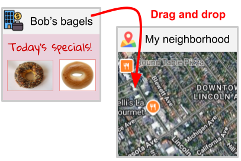
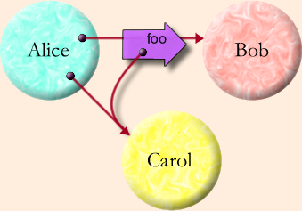

Google Caja was a project to build an object-capability sandbox within the JavaScript virtual machine.

## Origins

While working on the [Thing Browser](/portfolio/work/thing_browser/) proposal, I ran into a ton of trouble with security. Consider this situation:

In this scenario, **Bob's bagels** is an object of type `Business`. **My neighborhood** is an object of type `Map`. Imagine also some UI affordance to drag-drop a reference to **Bob's bagels** into **My neighborhood**, which could:

* Give **My neighborhoood** access to **Bob's bagels**, placing the latter at the correct position on the map; and/or
* Give **Bob's bagels** access to **My neighborhood**, allowing the former to search for nearby businesses I am interested in and provide competitive offers for yummy bagels.

Imagine also that both these objects are protected by traditional ACLs guarding what identities can use their functions. What happens from a _security_ viewpoint?

* What ACL is modified? The ACL of **Bob's bagels**? Of **My neighborhood**? Both?
* What are the identities in those ACLs? Does each object in the world have an identity?
* What happens under transitive sharing -- if I drag and drop **My neighborhood** into somewhere else, does _that_ get added to the ACL of **Bob's bagels**?

At around that time, Mark Miller, Alan Karp, and Marc Stiegler from HP Labs gave a presentation on the
[Virus Safe Computing Initiative](https://cs.sonoma.edu/colloquium/fall-2006/hp-labs-virus-safe-computing-initiative),
and I was introduced to the [object-capability model](https://en.wikipedia.org/wiki/Object-capability_model) of security. I learned that this handily deals with flexible sharing under mutual suspicion, and their ideas about "authorization by designation" completely fit with the problems I was facing. As they presented it, my scenarios were all special cases of the "Granovetter diagram" where **Alice**, invoking **Bob**'s method `foo`, passes a reference to **Carol**. If possession of a reference implies the authority to use it, we need no separate authorization plane, no identities, and no ACLs:

At the language level, object-capability security means that each piece of code has only the powers it is given by its caller; there is no _ambient_ authority. In practice, this means removing singletons. (See also 
[Singletons Considered Harmful](https://kentonshouse.com/singletons)
by Kenton Varda, who implemented large chunks of the
[protocol buffer](https://protobuf.dev/)
library.) Now this turns out to be a tough job, because most programming languages are riddled with _implicit_ singletons. But Mark Miller had already achieved this, with his language called [E](http://www.erights.org/).

Mark Miller's thesis on object-capability security,
[Robust Composition: Towards a Unified Approach to Access Control and Concurrency Control](http://www.erights.org/talks/thesis/),
is an amazingly well-written introduction to the topic. I had found my people. I dove into the topic with enthusiasm. Mark then joined Google as a Research Scientist, and at that time, "gadgets" and "mashups" were all the rage. We figured that building object-capability security into JavaScript was a good next step. We collaborated with Mike Samuel, who already had a prototype for adding extensions to Google Calendar, and got to work.

## Caja at Google

Mike Samuel had a fully featured JavaScript parser. I added a system to allow regex-like matching and substitution of language ASTs, called "quasiliterals"
([`c.g.caja.parser.quasiliteral`](https://github.com/googlearchive/caja/tree/master/src/com/google/caja/parser/quasiliteral)). We used this machinery to _cajole_ (i.e., render into a secured format) arbitrary JavaScript input. The core team grew to include Jasvir Nagra, Kevin Reid, and Mike Stay.

For a while, our work was used in [Google Apps Script](https://developers.google.com/apps-script) to sandbox user-supplied scripts. And we had a really cool demo within
[Google Wave](https://en.wikipedia.org/wiki/Google_Wave) where we could securely embed active content within a Wave, and have that recursively embed generic Wave content -- all backed by persistent storage in the Wave XML, subject to the 
[operational transformation](https://en.wikipedia.org/wiki/Operational_transformation)
collaborative algorithm. It was great! (And, Wave was canceled 2 days after our triumphal demo.)

Around that time, Mark Miller (primarily) worked with the [ECMAScript TC39](https://tc39.es/) committee to standardize some of the more important features. [`Object.freeze`](https://developer.mozilla.org/en-US/docs/Web/JavaScript/Reference/Global_Objects/Object/freeze), for example, is a direct result of Mark's advocacy.

An archive of our work can be found at [https://github.com/googlearchive/caja](https://github.com/googlearchive/caja).

## Secure ECMAScript and friends

While I personally moved on (to [Android Telephony](/portfolio/work/android_telephony)), this work has continued beyond Google, under the auspices of
[Secure ECMAScript](https://github.com/endojs/endo/blob/master/packages/ses/README.md)
and
[Hardened JavaScript](https://hardenedjs.org/). It is being funded by [Agoric](https://agoric.com/) as part of performing blockchain smart contracts securely.

## On Belay!

At some point, we proposed extending our work, and the result was the 
[Google Belay](https://code.google.com/archive/p/google-belay/) project. This was in turn somewhat split into two components:

1. The Belay Cloud Access Protocol (BCAP), a lightweight way to share capabilities through the Web browser. This was led and implemented by Mark Lentzcner, who created an extensive library and documentation, and a series of really cool sample applications.

1. A proposal to basically turn Chrome into a Thing Browser. According to this, we would figure out what the Web would look like if there were no domains; each URL was a capability; and each page referred to by a URL ran as a fully capability sandboxed entity. The key novel research questions were to be in user interface design. Not surprisingly, this was the direction I was interested in.

Both directions were under-funded, and Mark Lentczner and I moved on to other projects.

## And yet...

I remain a staunch believer that the object-capability security paradigm is far better than what we have today. Google's [Fuscia](https://en.wikipedia.org/wiki/Fuchsia_(operating_system)) operating system is a step in the right direction, though from my position as an outside observer, I have yet to learn their thoughts about the right way to build a user interface to object-capability underpinnings. I hope they succeed.