I am the founder and President of a little co-ownership club for a small airplane based in San Jose's Reid-Hillview Airport.

## Finding N291DR

I was going through a lot of machinations to get my [Airball](../airball/) equipment onto rental airplanes. Because of FAA regulations, one cannot randomly make modifications to airplanes that are rented out commercially, and that includes bolting or wiring un-certificated gadgets into them.

In the USA, an aircraft is registered as [experimental amateur-built](https://www.eaa.org/eaa/about-eaa/eaa-media-room/experimental-aircraft-information) (E-AB) if an amateur has performed 51% or more of the work to build it. It is then governed by far more lenient rules -- including a stipulation that anyone can perform maintenance on it, and that components added to it need not be certificated by the FAA.

The resulting aircraft can be very well-built and safe, and often include more modern components because owners can pick things off the shelf rather than being restricted to tried-and-true "real" airplane parts.

To properly work on Airball, I was going to need an E-AB aircraft of my own. So I set about surfing [Barnstormers](https://barnstormers.com/) and found one I liked -- [N291DR](https://www.youtube.com/watch?v=IXAp7kWFxgg), a [RANS S-6S Coyote II](https://en.wikipedia.org/wiki/Rans_S-6_Coyote_II) built from a kit by Dave Rigotti of Chesterland, Ohio and first flown in 2014:

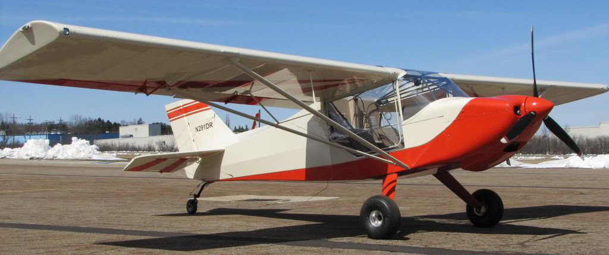

## Setting up CVSF

I collected 3 other pilot friends and proposed that we form an ownership club. The Experimental Aircraft Association publishes a [flying club manual](https://www.eaa.org/eaa/pilots/flying-club/flying-club-manual) that explains the legal steps to setting up such a club. Following that advice, we constructed **Coyote Valley Sport Flyers** as a [California Nonprofit Mutual Benefit Corporation](https://www.nolo.com/legal-encyclopedia/what-is-a-california-nonprofit-mutual-benefit-corporation.html), with Federal tax status as a [501(c)(7) social club](https://www.irs.gov/charities-non-profits/other-non-profits/social-clubs). We set up a bank account, and after some confusion, the bank people said, "Oh, your organization is just like the [Elks](https://www.elks.org/)!" So it is. I made up a logo:

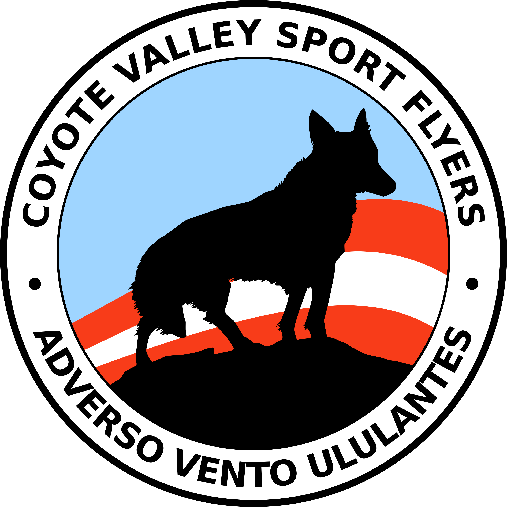

The Coyote Valley is the name of the lowlands South of San Jose, and the airplane model is "RANS Coyote II", so it all fit. Our motto, _adverso vento ululantes_, means "howling into the wind". Pilots take off into the wind, but we are Coyotes, and so.... Here all week, people.

## Getting the plane home

By that time, it was December 2018 and very cold and snowy in Ohio, which is where our airplane was. Someone needed to ferry it back to California. Luckily, two of our club members, Sergey and Valentin, are no strangers to bitterly cold weather, and they volunteered to do the job. Any operation of that magnitude certainly requires a mission patch:

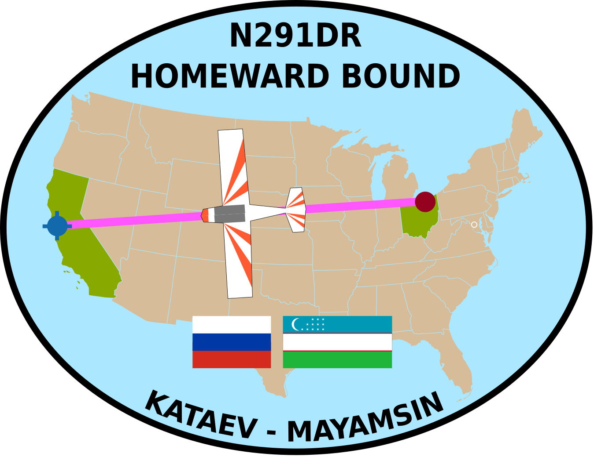

The patch commemorates the fact that Sergey Kataev is Russian, while Valentin Mayamsin is from Uzbekistan, showing the international collaboration of the aeronauts, and our dedication to global peace and understanding, and to inspiring young people towards future careers in STEM. Or something.

On a day in January 2019 that was cold in San Jose and even colder in Ohio, Sergey and Valentin bravely set out on the ferry mission:

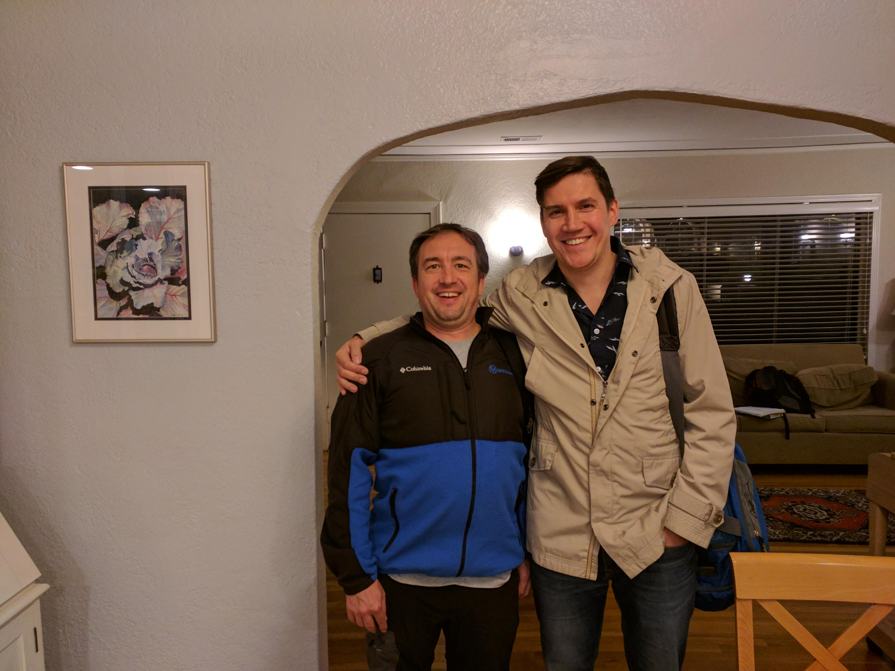

The route took them Southward to get out of the cold as fast as possible, and a total of 5 days of flying:

| 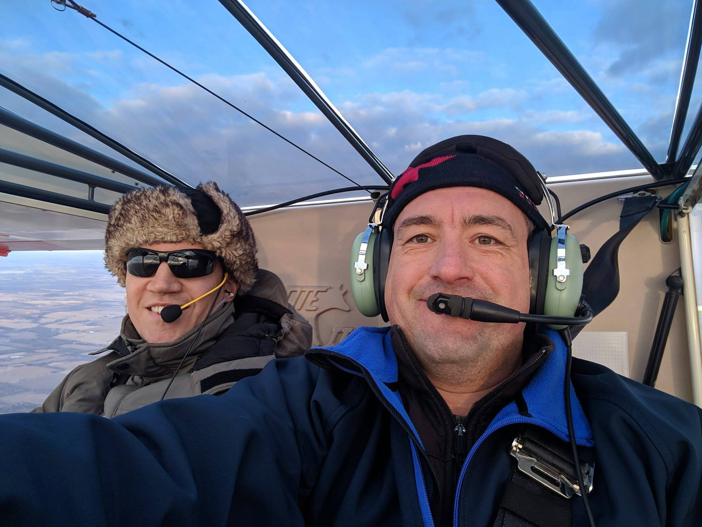 | 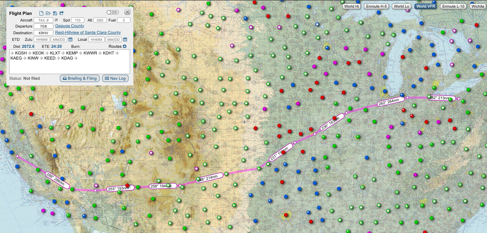 |

I served as "mission control", following the progress on the map using Valentin's GPS tracker. Because we are 
cheap
frugal, we opted for the 10-minute interval update on the GPS, and you know what? In aviation, a lot can happen in 10 minutes. There were times I could have sworn they had crashed, only to see their location pop up again on the ramp in some Podunk airport somewhere. Fun times.

On February 1, 2019, N291DR landed for the first time at [Reid-Hillview airport (KRHV)](https://skyvector.com/?ll=37.33451461092746,-121.82349586129342&chart=301&zoom=1) in San Jose, with Sergey at the controls making a lovely wheel landing:

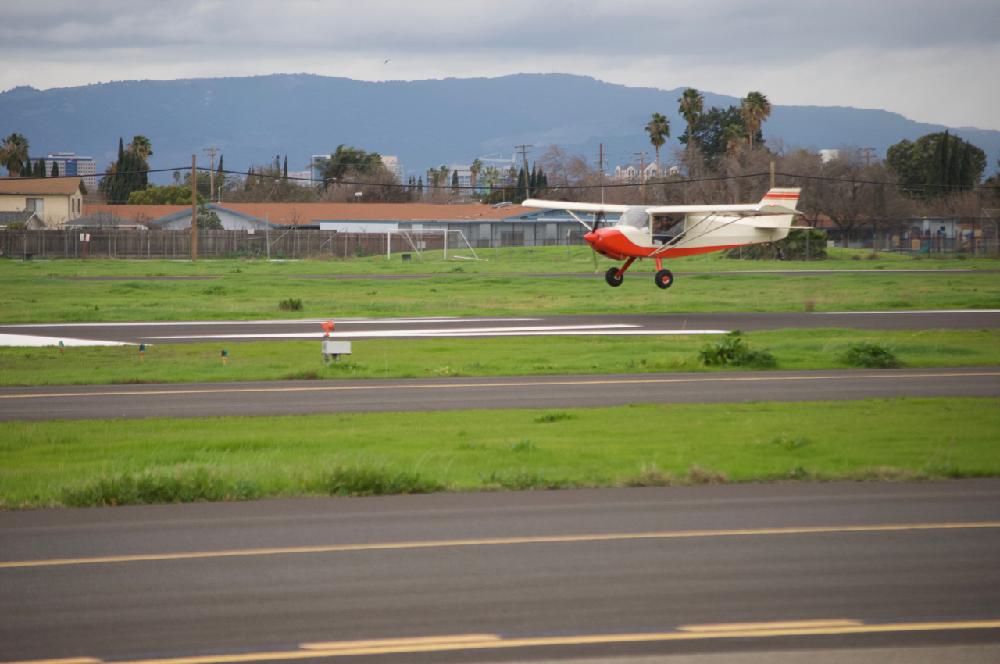

And for the first time, all the Coyotes were united with their Coyote:

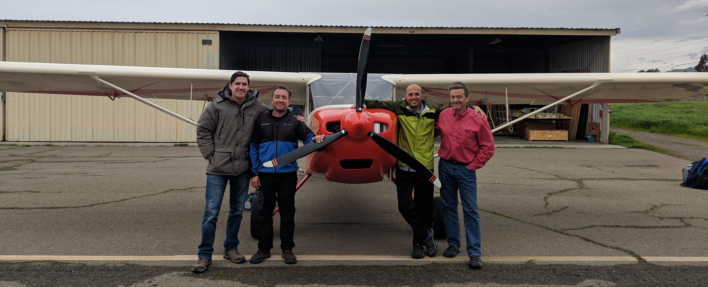

## Owning a plane

A plane that you own is not really that much cheaper than rental. The difference is in the fixed versus marginal cost: With a rental, you pay _all_ the money on a per-hour basis, so the marginal cost of each additional hour of flight is quite large. In our o-ownership, we charge ourselves $15/hr plus gas -- we agree to leave the plane full of gas after we're done. It feels much more like the plane is there, so we might as well fly it.

Since it's an E-AB, we do our own maintenance as much as possible, and we can get stuff from the auto parts store where it makes sense:

| 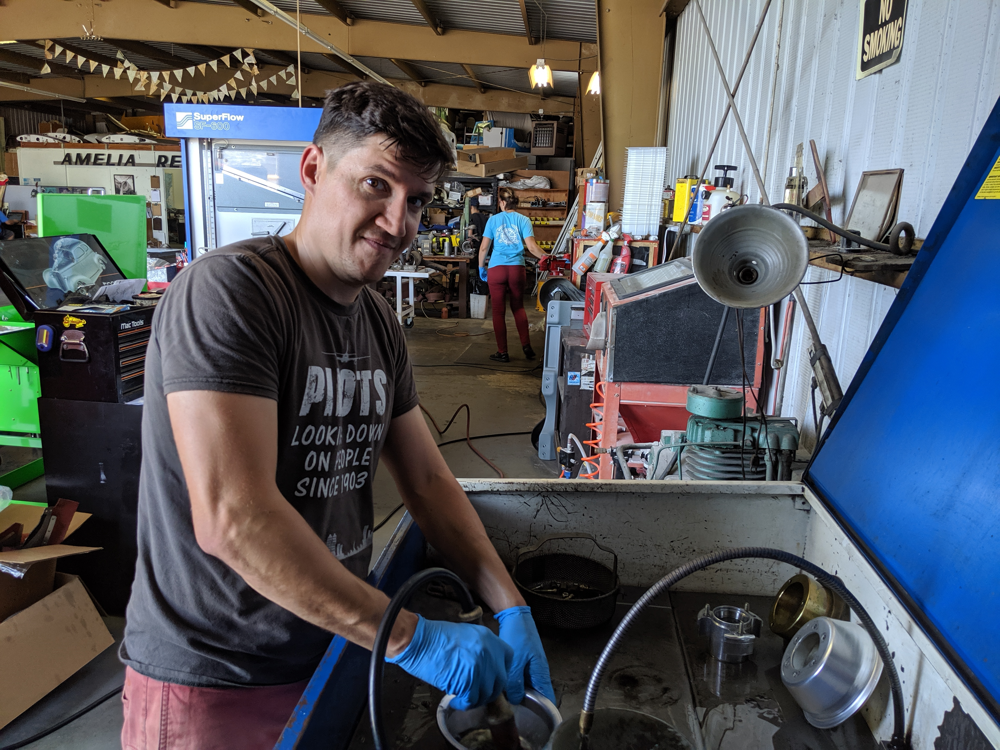 | 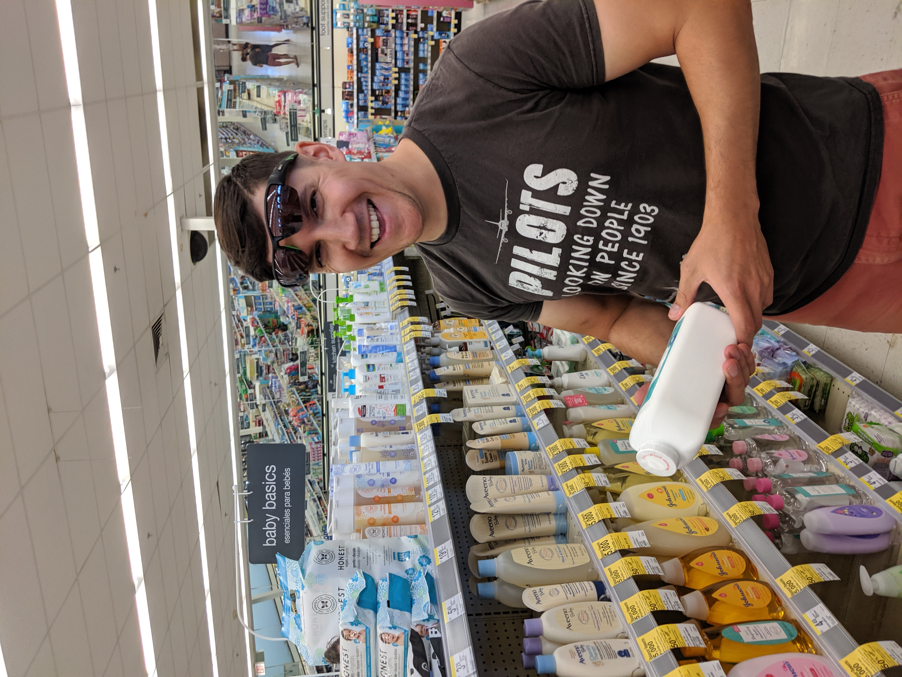 |

At some point, we decided to upgrade the panel, adding an electronic gadget that combined a bunch of instruments and made the plumbing simpler. We were able to do the work ourselves, using [SendCutSend](https://sendcutsend.com/) to make the new sheet metal and printing and laminating our own labels, and in so doing saved a ton of money!

| 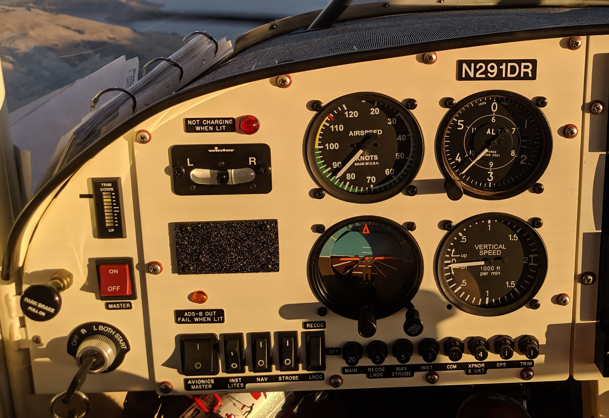 | 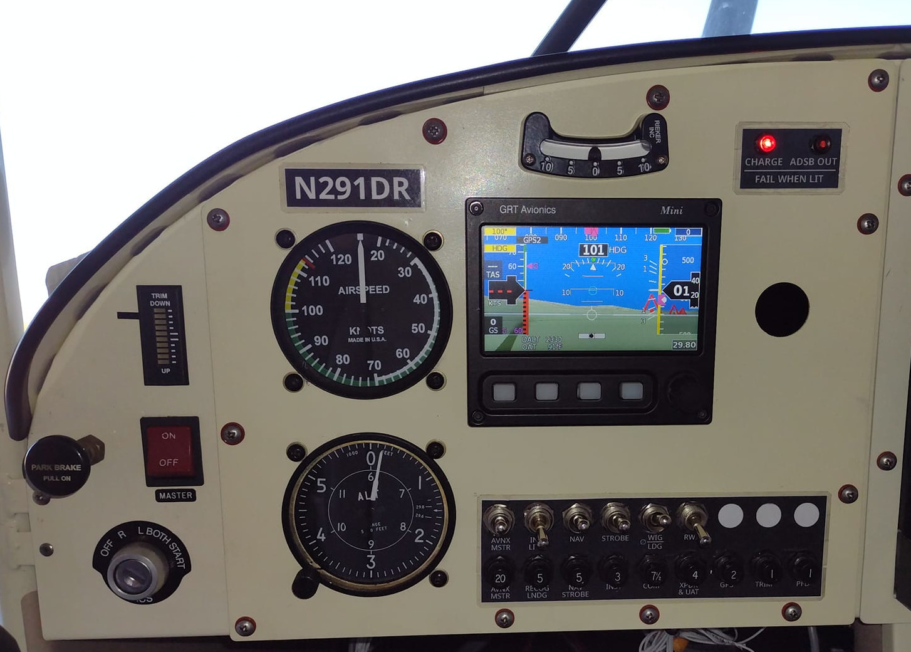 |

The FAA recently released the [MOSAIC](https://www.eaa.org/eaa/news-and-publications/eaa-news-and-aviation-news/2025-07-22-mosaic-is-done) rule, which makes maintenance of E-AB aircraft even more simple; by taking a class, amateurs who did not build the airplane themselves can qualify to do _all_ the maintenance. We are looking forward to that!
