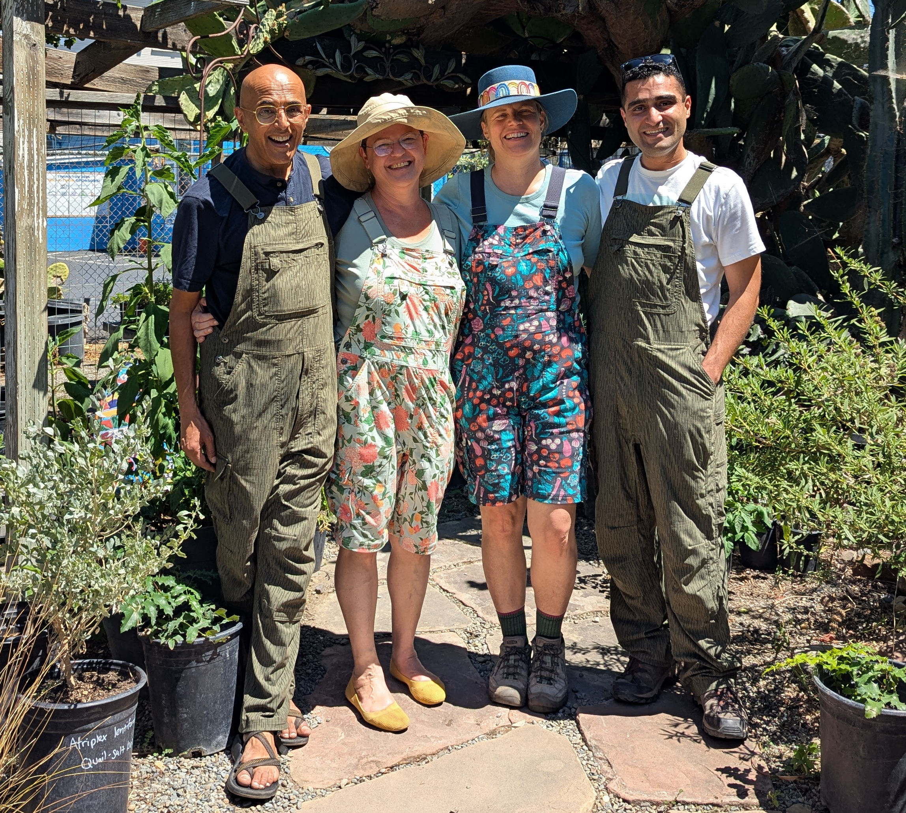
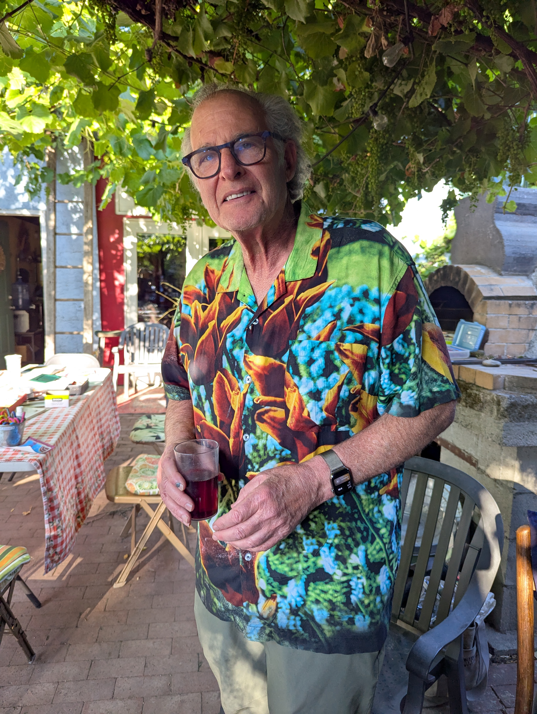
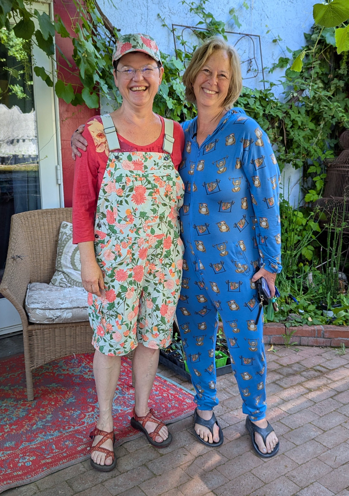

I volunteer at a local nonprofit, [Plant and Soul California](https://plantandsoul.org/), that centers community and food resiliency.

## The ecological challenge

One day 5 years ago, my wife and I ran into [Alrie Middlebrook](https://alriemiddlebrookdesign.com/about-alrie/) at a farmer's market. Alrie explained her two-part vision, which was to:

1. Restore our local ecology by re-introducing native plant species; and

1. Encourage regenerative organic local food production in urban areas.

This resonated with my engineering mind. Native plant species are adapted to the local climate and soil, and work together to form a functioning biome. These in turn support native animal species, which are also locally adapted. Using native plants as part of [regenerative organic](https://regenorganic.org/) food gardens allows us to reduce our reliance on food transportation, artificial fertilizers, and chemical pesticides, in a world where these largely fossil fuel dependent resources are increasingly scarce.

The people Native to our area prior to the arrival of Europeans have long practiced [deliberate husbandry](https://nfu.org/news/the-indigenous-origins-of-regenerative-agriculture/) of the natural environment, though some of the techniques, like agroforestry, were not recognizable as "farming" to European settlers and were dismissed. Much of this knowledge is lost, but what we can remember or re-learn can help us build food sources that rely on resilient biomes rather than chemically induced monocultures.

In our city of San Jose, many children grow up never having encountered nature. They live in [food deserts](https://www.ers.usda.gov/amber-waves/2011/december/data-feature-mapping-food-deserts-in-the-u-s) where fresh food is hard to get, on incomes that do not support a healthy diet. It is no surprise that we have a diabetes epidemic; see my work on the [Verily Retinal Camera](../verily_retinal_camera/) for more details.

Plant and Soul California (formerly the California Native Garden Foundation) is trying to do something about all these challenges. The organization runs a teaching garden and gathering space about 2 blocks from our house, and my wife and I both volunteer there.

## Local kinship

Again thinking as an engineer, I observe that I and people like me, in the 20th and 21st centuries, have accelerated the pace of technological "progress" in communication, transportation, and manufacturing, at a rate unprecedented in history. Compared to ancient times when one could assume one's parents and children would share one's general world view, we face a double threat where this increased pace of change comes with increased human lifespan, taxing any one person's capacity for adaptation.

The result is _trauma_. Even "good" things like having a car and being able to choose whether to have Chinese food or pizza for dinner can be seen as a form of trauma, in that it reduces stability and brings about decision fatigue. And as Jonathan Hait observes in [_The Righteous Mind_](https://en.wikipedia.org/wiki/The_Righteous_Mind), certain things about us and our environment drive us to respond differently.

As I hint when speaking about my [ethos](../ethos/), I do not believe that yelling on social media is an effective way to resolve the dilemmas that modernity has imposed on our collective minds. But I also don't believe in doing nothing. My contribution is to help create inclusive, hyper-local kinship.

Plant and Soul California, through its community events, creates this kinship among people of all ages, national origins, income levels, and ideological viewpoints. Young volunteers from tech companies mix with empty nester parents, and people bring their relatives.

## How I try to help

The organization has built a community space on 76 Race Street in San Jose, and a community garden in a nearby elementary school. I attend regular social events and help with prep and cleanup. I talk to all who would listen about why the mission appeals to me, even as the tech-focused person I am. And I help with maintenance and construction.

Plant and Soul California is my main social hub, and I count among my fellow volunteers people that I met through the organization and whom I have come to consider chosen family.

|  |  |  |

