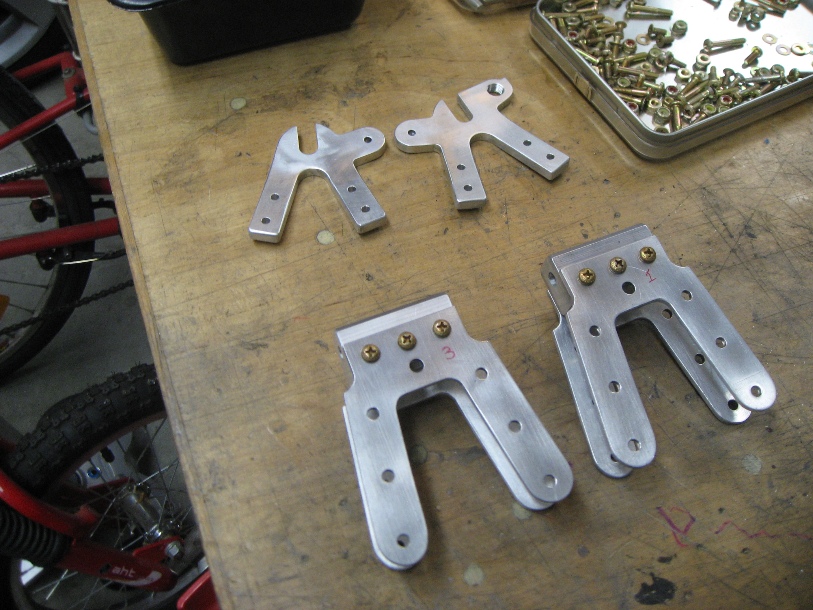

I have been -- and to some extent remain -- 
[a big fan of riveted aluminum](https://www.youtube.com/watch?v=StVhYPaekCI). Stay for the sordid details.

## Monocoque

I love airplanes, and in particular, aircraft structures. And the most commonly used aircraft structure, for lightness and stiffness, is a _semimonocoque_. First let's start with a pure monocoque:

This is a structure where a thin shell resists all the loads, like an egg. Now, the problem is that thin shells can _buckle_ when under load:

The answer is to stiffen the shell just enough so it does not buckle, typically using _stringers_. The result is a semimonocoque:

This basically describes the insides of any commercial airliner, and most other aircraft, as with this Boeing 737 in the factory. In the right hand side photo, you can see how both the wing and the fuselage are semimonocoque shells, and they intersect in a really cool way:

Now the way this is _manufactured_, traditionally, is via riveted sheet metal:

Notice how _all_ the parts of the structure in this picture are made of _amazingly thin_ sheets of metal. Notice the clever arrangement of the rivet lines to transmit loads in the correct direction. And this is how floppy sheets of thin metal become a stiff, strong structure that can take off, fly, and land. The way something so wobbly becomes strong and stiff as you assemble the pieces is ... amazing. It's a wonderful illustration of structural principles in action.

## Aircraft sheet metal

Aircraft sheet metal construction is a world unto itself. The number of tools and techniques is dizzying. A couple of great resources from the FAA are:

* [AC 43.13-1B, ACCEPTABLE METHODS, TECHNIQUES, AND PRACTICES -- AIRCRAFT INSPECTION AND REPAIR](https://www.faa.gov/documentlibrary/media/advisory_circular/ac_43.13-1b_w-chg1.pdf)

* [MMPDS-01, METALLIC MATERIALS PROPERTIES DEVELOPMENT AND STANDARDIZATION (MMPDS) (31 JAN 2003) [SUPERSEDES MIL-HDBK-5J]](http://everyspec.com/FAA/FAA-General/DOT-FAA-AR-MMPDS-01-JAN2003_24102/)

You can also learn a lot simply by browsing through the catalog of a supplier like 
[Yardstore](https://www.yardstore.com/) -- though be careful because you just might be tempted to buy a very nice
[drill](https://www.yardstore.com/pneumatic-and-cordless-tools/pneumatic-and-cordless-drills/pneumatic-pistol-grip/new/universal-tool-5-16-drill-2400-rpm-jacobs-keyless-chuck-ut8892-24), and then we'd all be sorry.

## Experimental aircraft

The USA is the birthplace of aviation, and the best place to be an airplane fan! Every year, thousands of airplanes converge on a single airport ([KOSH](https://skyvector.com/?ll=43.994247051972096,-88.52584075360126&chart=301&zoom=1)) in Oshkosh, Wisconsin, for a week-long festival called 
[Airventure](https://www.eaa.org/airventure), run by the 
[Experimental Aviation Association](https://www.eaa.org/). This is an annual Woodstock of aviation. The sheer volume of airplanes, as far as the eye can see, is stunning:

Many of these airplanes are built from scratch, using plans that are sold by hobbyists, or from kits made by companies. And yes, a kit built airplane can be built from top-notch materials and fitted with modern navigation and safety equipment! While I am happy with my co-ownership of
[N291DR](../n291dr_cvsf/index.html), I hope one day to build a plane of my own. My choice would be the
[RANS S-21](https://www.rans.com/s-21-outbound),
designed by the same designer of N291DR, my friend Randy Schlitter.

## Something to rivet

While waiting for the chance to build my dream airplane, I once decided to do the next best thing: Build a _bicyle_ using the same techniques. Because ... why not?

|  |  |   |
|  |  |  |
|  |  |  |

See the 
[**full build album**](https://goo.gl/photos/98bHq2jrhLNGig8f7) for more photos!

The result was a fairly unique looking vehicle -- one that turned heads and got people asking me how much I was willing to accept for it!

|  |  |   |
|  |  |  |

See the 
[**full completed photos album**](https://goo.gl/photos/XEssmfxDWBRK6L8Y8) for more photos!

At the time, we lived in Palo Alto, and my son attended the local elementary school. I hooked up his trail-a-bike to my contraption, resulting in this ridiculous arrangement:

One day, as we rolled around the neighborhoods in this configuration, none other than Steve Jobs himself drove past us, and looked at us with a bemused smile.... And that was 15 seconds of fame that my little creation got.

## Now let's go pro...

For every hobby of mine, I imagine myself creating a business. Not because I am fundamentally motivated to make money. Rather, I love what I love so fiercely, and I want to share it with the world. And so it is with my riveted aluminum. I imagined the next version of my design, where a kit builder would get a box of parts and rivets, and enjoy the delight of putting their own bicycle together! I got rather good at using the sheet metal module of SolidWorks, and designing using AR-MMPDS-01 allowables (see above).

|  |  |   |
|  |  |  |

However, spinning up an operation like this takes money up front, and the business case just wasn't there. Alas.

## Match hole CNC sheet metal

The crucial technique that I would have used in my kits, and that actual modern sheet metal work uses, is match hole construction. Basically, it means that you design your entire structure using CAD, down to the last detail, with every tiny hole modeled digitally. And then you cut, drill, and fold the metal parts using precision computer equipment so that all the holes match up, just like a big Erector set!

The
[RANS S-21 kit airplane](https://www.kitplanes.com/rans-s-21-outbound-review/) that I so love comes in a kit just like that!!

