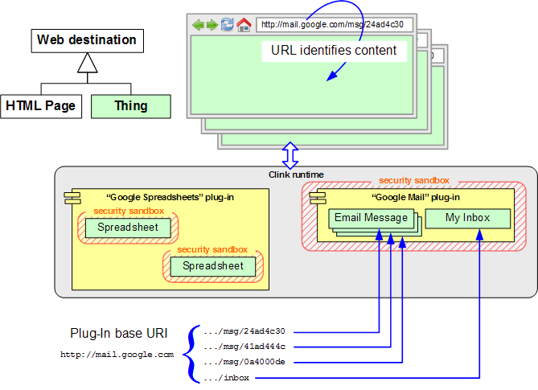
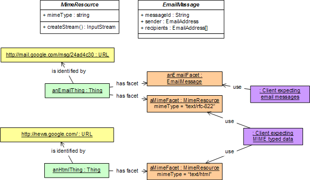

Thing Browser was a project proposal I made early on in my tenure at Google, to recast the Web as a network of user composable distributed objects.

## The inspiration

As I describe under
[FavaBeans](/portfolio/work/favabeans/),
I am a big fan of object-oriented user interfaces. I expected the Web to be the most popular platform for distributed computing, and it was natural to imagine that each URL identifies a distributed object.

What if we could build these ideas into a Web browser, in such a way that plain HTML Web pages are just very simple distributed objects?

My project used some tech that was popular at the time: 
[Java Web Start](https://docs.oracle.com/javase/8/docs/technotes/guides/javaws/) to launch applications, and 
[OSGi](https://www.osgi.org/) to distribute software modules.

## What we got working

My friend Mahlen Morris suggested a movie editor as a way to make "Ken Burns animations" out of Web content and republish it as Web content, and another friend with experience in bioinformatics made a "protein molecule" viewer that plugged into the system. I made handlers for common media formats like images, sound clips, plain Web pages, and a few other things.

The result was an iMovie-like interface allowing a variety of Web and Java resources to be remixed into an animation. It could accept as audio or visual "tracks" any objects that supported the necessary `Facet`s.

Sadly, no screenshots or easily workable prototypes of the actual code survive, but it was a really cool UI, and the "Ken Burns animation" concept proved to be a really nice way to demonstrate how content interoperability could lead to novel "application" innovation.

The internal implementation of the Thing Browser framework provided an interface discovery framework (similar to `IUnknown` in Microsoft COM) to discover supported `Facet`s. Groups of URLs were mapped to OSGi bundles which were dynamically composed into the system. Each bundle had a URL handler which would return an object that the framework could then display.

The whole thing would be bound together by an "interface repository":

