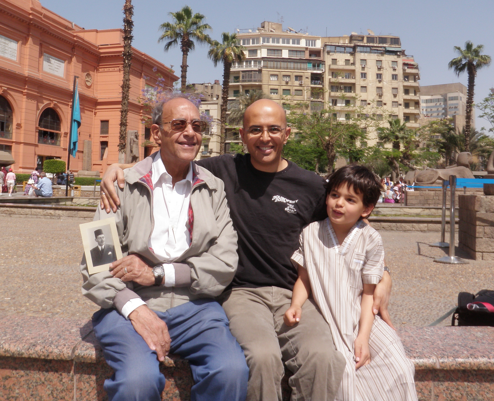
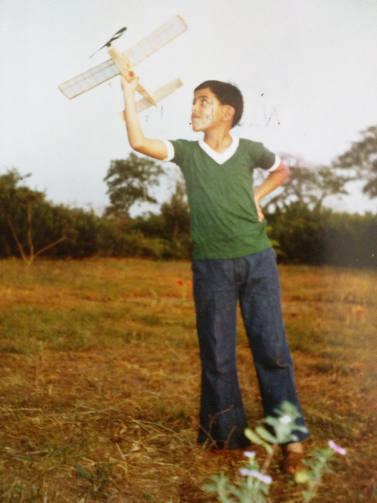
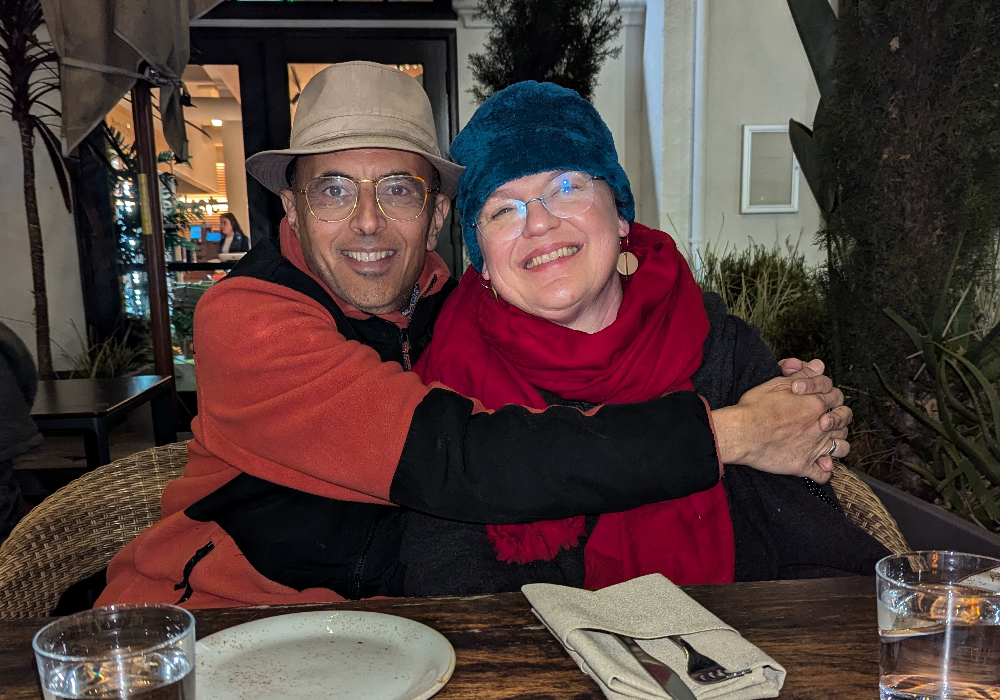

I have lived in a variety of different places throughout my life. I believe it has colored my experience very strongly, and I am grateful for what I have learned.

## Where it began

My grandfather Hamed Awad was the first to travel from his home town of al-Munifiyya, in Lower (Northern) Egypt, to the big city, to seek his fortunes. He became a well-known lawyer, eventually defending superstars like <a href="https://en.wikipedia.org/wiki/Mounira_El_Mahdeya">Mouniar El Mahdeya</a> (after whom my aunt Mounira was named). He wore a fez and tailored European suits. He represented a path of progress and "betterment" that was to be my path too, and also, my greatest stumbling block.

My dad's best friend growing up in the 1940s was a young Egyptian boy named Yusuf Marco Levy. (For those who don't know: This is a very distinctly Jewish name.) This was a time when, even though conditions were by no means ideal, Jewish folk lived side by side with others in Egypt. The story of Yusuf Marco is the story of a deep wound in the people of the Middle East, and one which remains bleeding.

In the following photo, we see (left to right): Grandpa Hamed, my dad Abd-el-Hamid, myself, and my son Aden.

## Living in Nigeria

My parents escaped the rather oppressive regime of <a href="https://en.wikipedia.org/wiki/Gamal_Abdel_Nasser">Gamal Abdel Nasser</a> in the early 1970s. Perversely, Egypt had collaborated with the Nigerian Federal government in the Nigerian civil war in the 1960s, making this a place where the Egyptian secret police (the _mukhabarat_) would allow us to go. We stayed in Nigeria for 10 years, and I have many fond memories of that time. Many of my class mates went on to have wonderful careers, in and out of Nigeria, and I am connected with some of them.

And back then, I had aspirations to engineering. My dad was an aeronautical engineer, so my mind went to airplanes.

## Coming to the USA

I started college at the University of Florida a year after arriving in the USA, and, naturally, studied engineering. I then went to grad school at the University of Minnesota -- twice, one for mechanical engineering and one for computer science. There I met my wife, and we moved to Silicon Valley.

## Where I ended up

I am perenially deracinated; native to nowhere, and unable to take my situated-ness for granted. This is a gift as well as a curse. And it has taught me to pay attention to how my story fits into the global shifts of fortunes and cultures.

When grandfather Hamed left his village, he adopted the styles of the Ottoman and European colonial powers that were at that time prevalent in the Middle East. As his descendant having worked at Alphabet for 20 years, I have inherited a great amount of the privilege that he helped create, and it has served me very well.

But I also inherited an at best enigmatic relationship with my own Egyptian body. To take on this progress narrative, one often has to leave behind the sense that one is okay to just _be_, without justification. One has to contend with a variety of colonial pecking orders, in which one is sometimes up and sometimes down, but never just _okay_, and these have intersected with my various situations in the places where I have lived.

The gift is that, from all this variety, I can see the common threads of human wonder and fallibility. There is no _them_ and _us_; there is just _everyone_, trying their best to live in a rapidly changing world. And I get to be here to experience it.