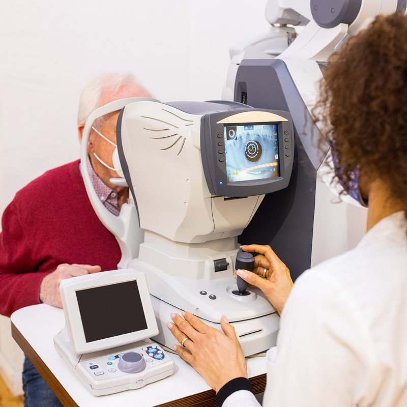
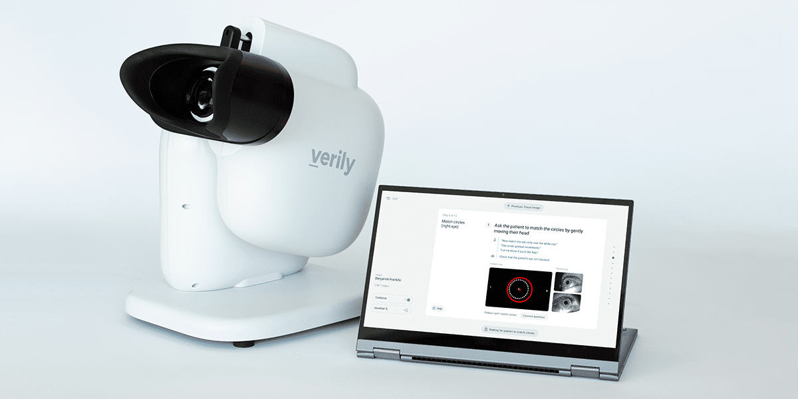
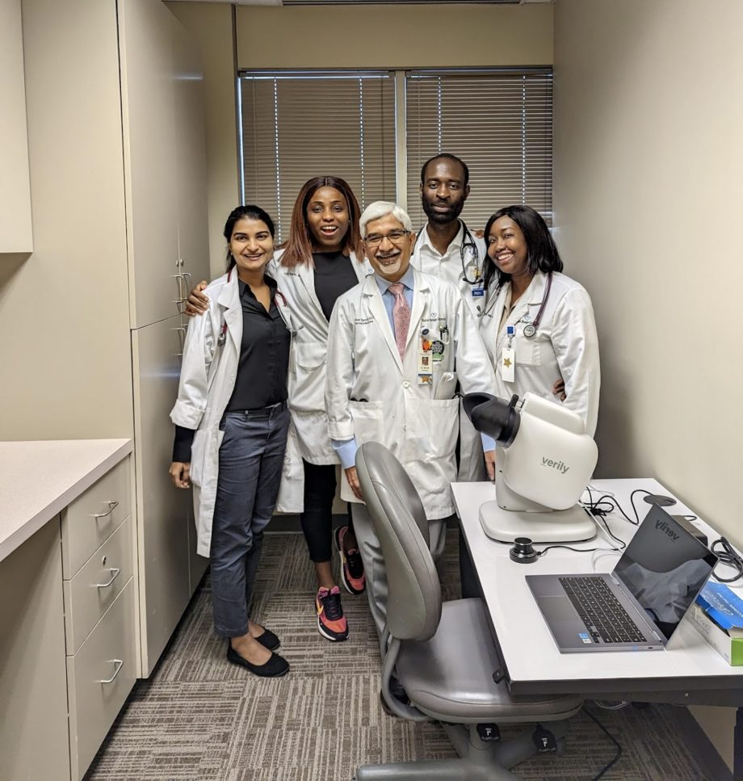
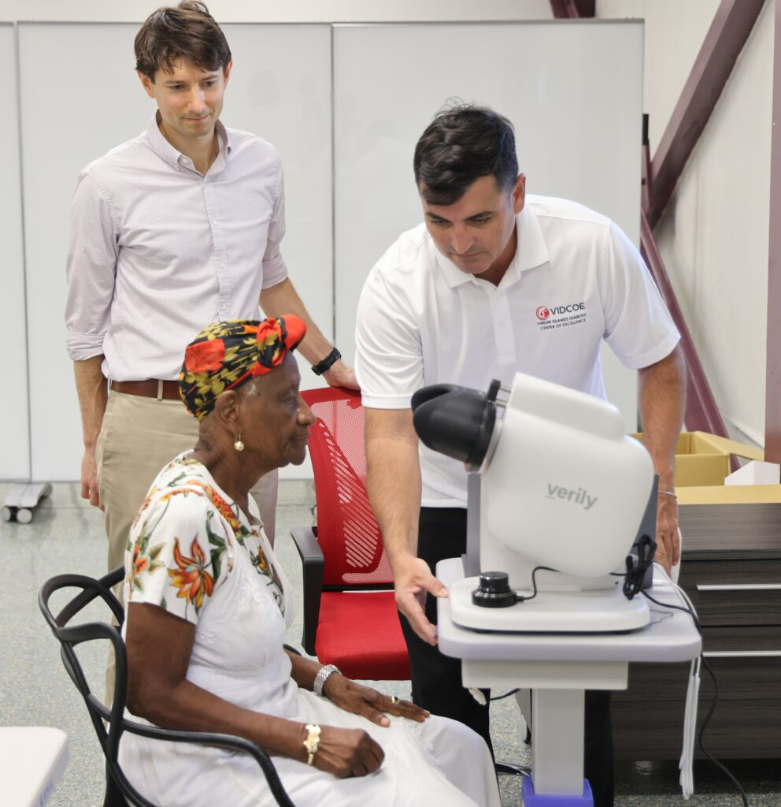
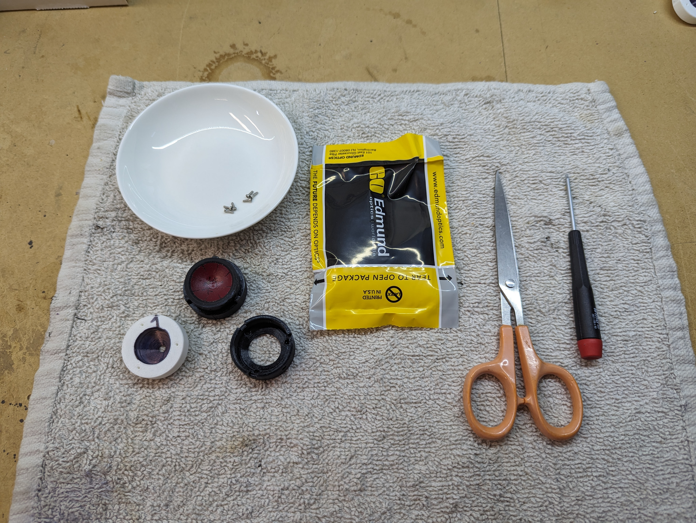
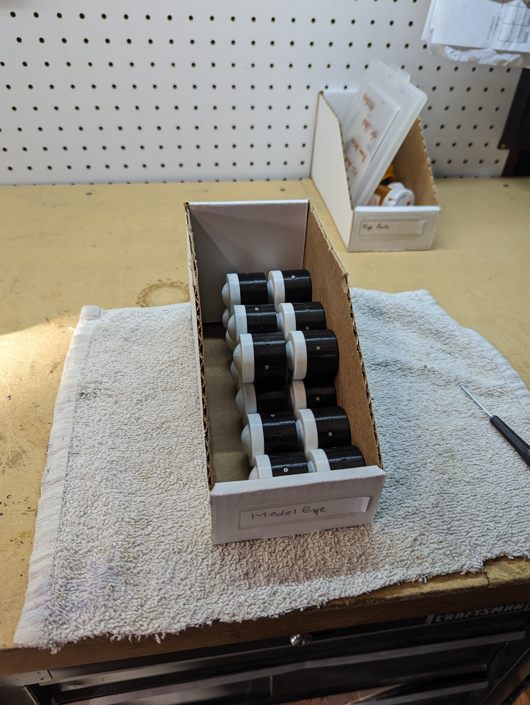

I served as the software tech lead for the Verily Retinal Camera through one commercially available model and one partially completed R&D cycle (interrupted because Verily exited the business).

## Fundus imaging for diabetic retinopathy screening

The USA (and much of the world) has a diabetes epidemic. According to the
[World Health Organization fact sheet](https://www.who.int/news-room/fact-sheets/detail/diabetes), "[m]ore than half of people living with diabetes did not take medication for their diabetes in 2022". This is partly a regional problem potentiated by lifestyle, which is itself traceable to other demographic factors, as The [Centers for Disease Control](https://stacks.cdc.gov/view/cdc/46013) "have identified a diabetes belt located mostly in the southern portion of the United, [which] consists of 644 counties in 15 states." And according to the
[Centers for Disease control](https://www.cdc.gov/diabetes/diabetes-complications/diabetes-and-vision-loss.html), "[d]iabetic retinopathy (DR) is the leading cause of blindness in working-age adults". The humanitarian and economic implications are vast.

As the [Mayo Clinic](https://www.mayoclinic.org/diseases-conditions/diabetic-retinopathy/symptoms-causes/syc-20371611) explains, diabetic retinopathy happens when, "[o]ver time, too much sugar in your blood causes damage to the tiny blood vessels that nourish the retina, cutting off its blood supply". According to an [Endocrinology and Metabolism article](https://doi.org/10.3803/EnM.2023.1913), "[a] prompt and accurate diagnosis is crucial for ensuring favorable visual outcomes.... AI-based diagnosis of DR has the potential to improve medical accessibility". But to apply AI techniques, one must first get information about what is going on inside the patient's eye. This is in the form of a _fundus image_.

A fundus image shows the back of the eye -- including portions of the retina. The [Cleveland Clinic](https://my.clevelandclinic.org/health/diagnostics/fundus-photography) shows an example of an eye specialist acquiring a fundus image with a specialized camera, and beside it is an example of a typical fundus image:

|  |  |

The challenges with obtaining a good fundus image include:

* The retina's job is to absorb light. If you want to see it, you must shine a ton of light so the amount reflected is adequate. This means you need a really bright light.

* Bright lights cause the opening of the eye -- the pupil -- to reflexively contract. You therefore have only a few milliseconds of bright light before your "porthole" into the eye becomes really small.

* Some patients naturally have really small pupils, making the problem harder.

* You can give a patient eye drops to dilate their pupil -- in technical terms, to induce mydriasis -- but this takes time and requires specialists, and visually disables the patient for a few hours afterwards. Hourly wage earners, in particular, may not be able to afford the "down" time during the day.

* Patients are twitchy and move their eyes and bodies around, so it's hard to get them to sit still. People with diabetes, in particular, may have trouble moving and aligning their bodies.

* Patients who wear eye glasses or contacts require the camera to be refocused to match their prescription so it can see clearly into their eye.

* The equipment is expensive. It must be operated by specialists, who cost money.

These are all barriers to _access_ to fundus imaging, especially for those who need it most. The challenge is to create a low-cost and easy-to-use system for fundus imaging, and if possible, to streamline the analysis of the images.

## The Verily Retinal Service

The Verily Retinal Service (VRS) was an Internet-of-Things camera, and a set of backend services, that health care providers and clinics could use to offer on-the-spot, low-cost and low-effort DR screening to their patients:

* Customers paid up front for cameras, and Verily charged a certain amount per screening.

* Verily sent them a camera they could connect to the Internet, managed the camera's software lifecycle, automatically sent the images to experts (and, soon, AI) for grading, and provided results to the customers. Verily created integrations with customers' Electronic Health Records (EHR) systems when needed.

## The Verily Retinal Camera

The Verily Retinal Camera (VRC) was the hardware portion of the work, and as noted above, I served as the R&D technical lead in two product iterations.

### First model

I joined when the VRC was a working prototype. It had some C++ programs on an nVidia Jetson embedded Linux computer running image processing and machine learning inference, and a collection of microcontrollers programmed using Arduino for controlling illumination LEDs and focusing the camera.

The hardware teams created a minimum viable product in a saleable form factor, which won [a prestigious design award](https://www.idsa.org/awards-recognition/idea/idea-gallery/verily-retinal-camera/).

For the user interface, we decided to bundle a convertible Chrome laptop, running a React Website hosted on the camera itself. This allowed us to use standard Web technologies to hit the ground running and create a much more fluid and intuitive experience than is usual for medical devices.

Our initial deployment was at the [Baton Rouge Clinic](https://batonrougeclinic.com/news-education/verily-retinal-service-at-the-baton-rouge-clinic/). We were all quite excited to jump in and help people right in the center of the "diabetes belt" with low cost solutions that could save their eyesight. And some of our deployments were as wide-ranging as the [Virgin Islands Diabetes Center of Excellence](https://www.vidcoe.org/diabetes-retinal-imaging-machine/).

|  |  |

### Next generation

For our next-generation system, we identified key areas to improve:

1. We required automatic positioning to the patient's eye, and auto-focus.

1. The guts of the hardware required a redesign for manufacturability, cost, and more up-to-date electronic parts.

1. Our software engineering and testing systems needed to prepare for scaling.

I led our efforts on the software, until Verily decided to exit the business.

## My contributions

For our first iteration, we were under a super tight schedule. My job, as I saw it, was to clarify the architecture as best I could, and then pick up a shovel and help the team.

Our first job was to move the bulk of our code out of Google's internal hosting into Github, where we could have a clean CI/CD system focused on devices, and we all chipped into this massive refactoring effort. I implemented chunks of the C++ functionality that ran the core imaging; worked on the Linux operating system on the nVidia Jetson processor; worked on some of the user interface; and a whole host of other functions.

I tended to just assign myself problems that nobody wanted, and solve them. At the start of the program, I noted the PMs and other folk were not super engaged, so I organized a "user persona study" session with large chunks of the team. Of course, seasoned UX people quickly told me that, Ihab, the use of a _persona_ is not the right tool here, you see.... And PMs stepped in to explain that we needed to identify our market before we dove into such details. I sat back and listened. Of course. You are right. Show me how it's done. And they did, and so we had UX and PM support.

One day I realized that our hardware-in-the-loop (HIL) testing was badly lacking. We did not, at the time, have assigned tech support -- Verily had other devices programs that were further along. So I went to the lab, cleaned up a space, and swept the floor. Then I ordered some relay boards from Amazon.com to let us "hard reset" our devices from code, designed a PCB to simulate user inputs, and set up a bunch of test-runner computers (Intel NUCs) on a KVM switch connected to our Github CI/CD. And we ended up with a sufficiently high fidelity simulation that we could now remotely run through test scenarios.

One other day, I noted that the [optically correct model eyes](https://ocularinc.com/ocular-imaging-eye-model.html) we were using for testing were expensive and in short supply. I designed a 3D printed alternative, and my mechanical engineer friend Bo Lu collaborated to improve the geometry and texture of the artificial retina. We now had dozens and dozens of perfectly useable model eyes for about $40 each (dominated by the cost of the [60 diopter plano-convex lens](https://www.edmundoptics.com/p/20mm-dia-x-16mm-fl-uncoated-molded-aspheric-condenser-lens/30547/) -- the rest of the parts were nearly free).

|  |  |

These model eyes worked so well that they were accepted by our test team for some of their FDA-visible QA testing, which meant that photos of me building my 3D printed eyes in my garage were now part of our Quality Management System (QMS).

For our second version of the VRC, we had the time to do much more thorough analysis of our architecture and design. I identified some important areas:

1. Solid firmware architecture and design using FreeRTOS. Clear definition of the communication protocol between nVidia Jetson and the firmware on an STM32L5. Hardware assisted clock synchronization allowing the entire system to timestamp events consistently, permitting more convenient data post processing.

1. Use of Yocto for cross-platform builds of our Linux system on the nVidia Jetson.

1. Extensive refactoring of our C++ code for reliability and modularity. We created several asynchronous coarse-grained modules, each of which had a configuration file schema and themselves consisted of several asynchronous "processes" running independently. These collaborated via async interfaces to work predictably. This was made possible by my creation of the [CppPromise](../cppromise/) system with the help of Limu Xiao. Using this system, we could casually define, implement, and use async interfaces in C++ without ever touching `std::thread` or `std::mutex`.

1. Clean design of the communication between our on-camera state machine and the React user interface, and clean design of the React user interface state. The UI was implemented as a Redux app which accepted a "state vector" published by the camera via a Websocket, and all behavior flowed functionally from that. Where the UI had local state, that was clear and also used Redux.

I interpreted my role as tech lead to be an architect, force multiplier, cheerleader, and when that was done, finisher of tasks along with everyone else. My goal was to be someone whom people came to for guidance voluntarily, because that made them more productive and helped them enjoy their job. I was privileged to serve the team and would work with any of them again on an upcoming project.